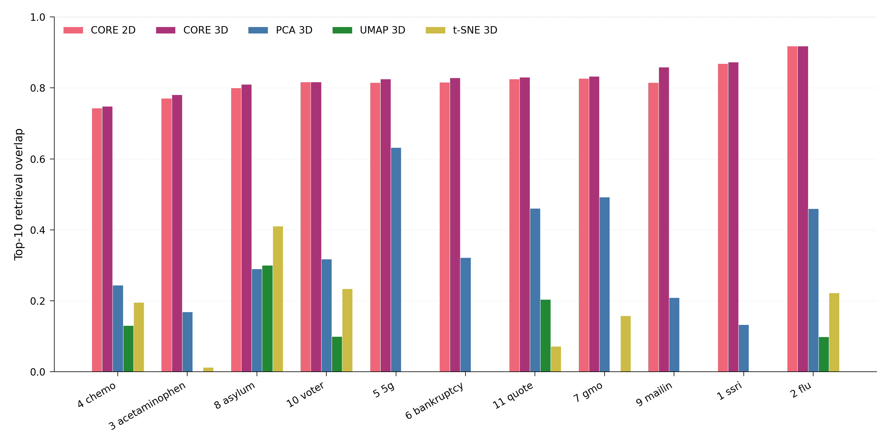
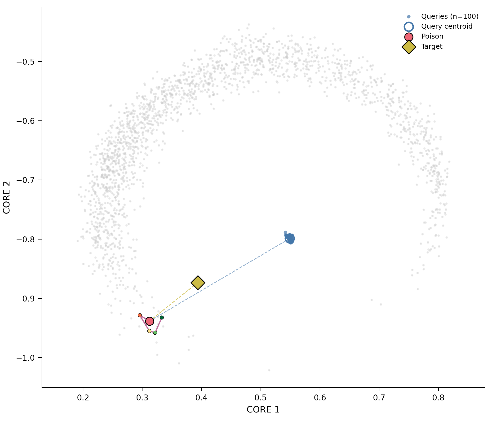
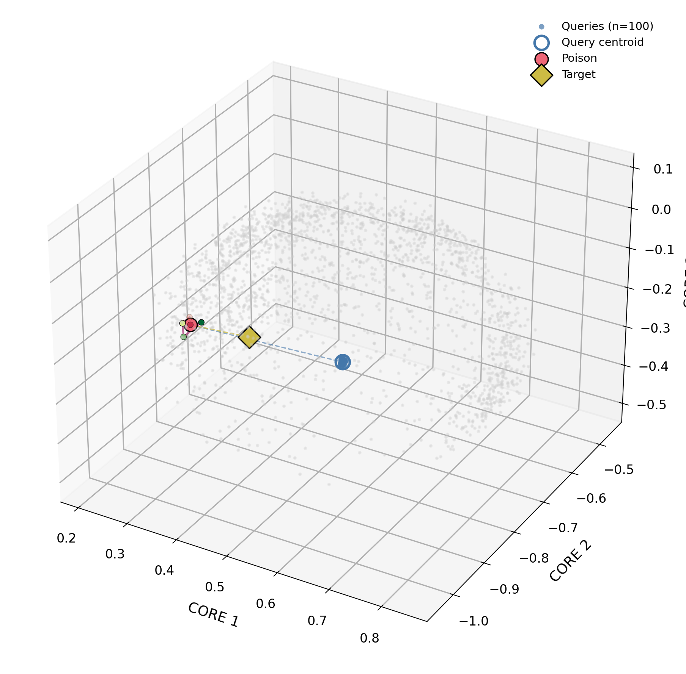

# rankviz

**Retrieval-aware visualisation for dense-retrieval and RAG systems.**

`rankviz` provides visualisation tools that preserve **retrieval-relevant
quantities** (rank, cosine similarity) rather than ambient embedding
geometry. Standard dimensionality reducers (PCA, t-SNE, UMAP) optimise for
the wrong objective in a retrieval context — none preserve the bipartite
query-document cosine structure that actually determines what the retriever
returns.

`rankviz` fills that gap.

---

## The headline contribution: **CORE**

**CORE** — **C**osine-**O**rdered **R**etrieval **E**mbedding — is a
dimensionality-reduction algorithm specialised for retrieval. It places
queries and documents in 2-D or 3-D such that Euclidean distance in the
low-dim space approximates `1 − cos(query, document)` for every
query-document pair, weighted so top-of-ranking is preserved more
faithfully than the tail.

### Benchmark: 11 domains × 5 projection methods

Evaluated on 11 dense-retrieval adversarial datasets (100 queries × 5000
shadow documents × 768-D E5 embeddings), using **top-10 overlap** as the
metric (fraction of each query's true top-10 corpus documents that remain
in the query's top-10 under the projection, averaged across queries).



| Method       | Mean top-10 overlap | Min  | Max  | Win rate |
|--------------|---------------------|------|------|----------|
| **CORE 3-D** | **0.829**           | 0.748| 0.918| **11/11**|
| **CORE 2-D** | **0.820**           | 0.743| 0.918| **11/11**|
| PCA 3-D      | 0.339               | 0.133| 0.632| 0/11     |
| t-SNE 3-D    | 0.119               | 0.000| 0.411| 0/11     |
| UMAP 3-D     | 0.076               | 0.000| 0.300| 0/11     |

**CORE wins on every domain.** In 2-D it beats PCA in 3-D by **2.4×** and
UMAP in 3-D by **10.8×** on average. Full per-domain numbers are in
[`examples/benchmark_results.csv`](examples/benchmark_results.csv).

### What CORE projections look like

A CORE fit on one adversarial RAG dataset (100 queries, 5000 shadow
documents), with the poisoned document highlighted in red, the target
in gold, and the optimisation trajectory as a coloured path. The same
code produces both views — 2-D is a publication-ready PDF; 3-D is an
interactive HTML file you can rotate in the browser.

| 2-D (matplotlib, for publication) | 3-D (matplotlib preview) |
|:---:|:---:|
|  |  |

Interactive versions (rotate, zoom, hover for exact coordinates) —
download these files and open them in any browser:

- 🌐 [`examples/figures/core_2d.html`](examples/figures/core_2d.html) — interactive 2-D
- 🌐 [`examples/figures/core_3d.html`](examples/figures/core_3d.html) — interactive 3-D

Re-generate the examples from your own data:

```bash
python scripts/generate_examples.py /path/to/your/trajectory.npz
```

### How CORE works — the algorithm

The goal is a low-dimensional coordinate space where Euclidean distance
between a query and a document reflects their cosine similarity in the
original high-dimensional embedding space — specifically, high-similarity
pairs (the ones that matter for retrieval) must stay close, and the
ordering that the retriever sees must survive the projection.

**Inputs.** Query embeddings $Q \in \mathbb{R}^{n_q \times D}$ and
corpus embeddings $D \in \mathbb{R}^{n_d \times D}$, both assumed
L2-normalised (so dot product ≡ cosine similarity). Target
dimensionality $k \in \{2, 3\}$.

**Objective.** Learn low-dim coordinates $Q^{\text{low}} \in
\mathbb{R}^{n_q \times k}$ and $D^{\text{low}} \in \mathbb{R}^{n_d
\times k}$ that minimise

$$
\mathcal{L} \;=\; \frac{1}{n_q \, n_d} \sum_{i=1}^{n_q} \sum_{j=1}^{n_d}
w_{ij} \, \Big(\, \lVert Q^{\text{low}}_i - D^{\text{low}}_j \rVert_2
\;-\; (1 - \cos(q_i, d_j)) \,\Big)^{\!2}.
$$

The target distance `1 − cos(qᵢ, dⱼ)` maps a cosine of 1 to 0 (identical)
and a cosine of 0 to 1 (orthogonal) — monotonic, so higher similarity
maps to shorter distance.

**Weights.** The sum is weighted per pair, with three available schemes:

| scheme          | $w_{ij}$            | effect                                |
|-----------------|---------------------|---------------------------------------|
| `"retrieval"` ✓ | $\cos(q_i, d_j)^4$  | strongly emphasises top-of-ranking    |
| `"rank"`        | $1 / \text{rank}(j \mid i)$ | explicit top-k preservation   |
| `"uniform"`     | $1$                 | plain bipartite MDS                   |

`"retrieval"` is the default and was best on the benchmark. Raising the
cosine to the fourth power means a cos-0.9 pair contributes ~0.66 to
the loss weight, while a cos-0.5 pair contributes only ~0.06. High-similarity
pairs — the ones that actually get retrieved — dominate the optimisation.

**Key property: only query-document pairs appear in the loss.** Not
query-query, not document-document. This is the bipartite asymmetry
that PCA / UMAP / t-SNE cannot express — they treat all points
symmetrically.

**Optimisation.**
1. **Initialise** $Q^{\text{low}}, D^{\text{low}}$ with the top-$k$
   right singular vectors of the stacked matrix $[Q; D]$ (PCA-style
   start), rescaled so initial inter-point distances sit near the
   target range.
2. **Full-batch gradient descent** for $N$ iterations (default 500):
   - compute all pairwise low-dim distances
     $d_{ij} = \lVert Q^{\text{low}}_i - D^{\text{low}}_j \rVert_2$;
   - per-query gradient
     $\nabla_{Q^{\text{low}}_i} \mathcal{L} =
     \frac{1}{n_d} \sum_j w_{ij} \, \frac{d_{ij} - (1 - \cos(q_i, d_j))}{d_{ij}}
     \big( Q^{\text{low}}_i - D^{\text{low}}_j \big)$;
   - per-document gradient is the mirror with opposite sign;
   - step size decays linearly from `lr` to `0.1 · lr`;
   - per-row gradient L2-norms are clipped at 1.0 to tame early iterates.

**Out-of-sample projection.** Once the query landscape is fit, new
points (the poison, each trajectory step, the target) project against
the **fixed** query coordinates:

$$
y^\star(\mathbf{x}) \;=\; \arg\min_{y \in \mathbb{R}^k}
\sum_{i=1}^{n_q} w_i \, \Big(\, \lVert Q^{\text{low}}_i - y \rVert_2
- (1 - \cos(q_i, \mathbf{x})) \,\Big)^{\!2}.
$$

A tiny gradient descent (200 iterations, $k$ parameters) solves this.
Two trajectories fit against the same $Q^{\text{low}}$ are directly
comparable, which is critical for the poison-optimisation paths in the
figures above.

**Why this beats UMAP / PCA / t-SNE at retrieval.** The comparison is
partly tautological — CORE is trained on exactly what the benchmark
measures (query-document cosine distance). That's the point: existing
methods optimise for variance, local neighbourhoods, or manifold
topology, and retrieval is none of those things. If you want to
visualise retrieval behaviour, the projection should be driven by the
retrieval relationship itself.

**What did not help** (tested during development and discarded):

- Triplet / hinge ranking loss (hurt overlap by 8–18 pp)
- Rank-as-distance target (`j / n_d`) — catastrophic collapse
- Random-init multi-restart — no better than SVD init
- Longer training past 400 iterations — plateau
- Over-complete training (fit in 5-D, PCA-compress to 2-D) — the
  compression step breaks the learned distances

The simple $\cos^4$-weighted MSE objective with SVD initialisation
is surprisingly close to the ceiling for this data class.

### Quickstart

```python
from rankviz import CORE, plot_landscape

# Fit the projection
core = CORE(n_components=3).fit(queries=Q, corpus=D)

# Project auxiliary points (highlight document, optimisation path, target)
fig = plot_landscape(
    core,
    highlight=poison,            # (d,) or (M, d) array
    trajectory=traj,             # optimisation path, (n_steps, d)
    target=target,               # (d,) — where the attack aims
    backend="plotly",            # interactive HTML
)
fig.write_html("landscape.html")
```

2-D for publication:

```python
core_2d = CORE(n_components=2).fit(queries=Q, corpus=D)
fig = plot_landscape(core_2d, highlight=poison, backend="matplotlib")
fig.savefig("figure.pdf")
```

One-liner convenience:

```python
from rankviz import quick_plot
fig = quick_plot(queries=Q, corpus=D, highlight=poison, kind="rank_carpet")
```

### API summary

| Call                                     | Returns                               |
|------------------------------------------|---------------------------------------|
| `CORE(n_components=2|3)`                 | A configured, unfitted estimator      |
| `.fit(queries, corpus)`                  | `self`                                |
| `.transform(X)`                          | `(d,) → (k,)` or `(n, d) → (n, k)`    |
| `.fit_transform(queries, corpus)`        | `(Q_low, D_low)`                      |
| `.query_embedding_`                      | fitted query coordinates              |
| `.corpus_embedding_`                     | fitted corpus coordinates             |
| `.loss_history_`                         | per-iteration training loss           |

sklearn/umap-learn conventions: `.fit()` returns `self`, `.transform(X)`
projects new points without refitting.

### Weighting schemes

| `weight=`        | Behaviour                                             |
|------------------|-------------------------------------------------------|
| `"retrieval"` ✓  | Weight pairs by `cos⁴` — emphasises high-similarity pairs |
| `"rank"`         | Weight pairs by `1/rank` — explicit top-k preservation    |
| `"uniform"`      | Plain bipartite MDS                                       |

`"retrieval"` is the default; it was the best performer across the 11-domain benchmark.

---

## Companion visualisations (no projection)

`CORE` is the projection engine. `rankviz` also provides visualisations
that use retrieval-relevant axes **directly** — no projection, no loss of
information.

### `RankCarpet`

Per-query rank profile of highlight documents. X-axis: queries (sorted by
highlight rank). Y-axis: rank (log, inverted). Corpus shown as percentile
bands; highlights as bold lines with reference lines at `k=10`, `k=100`.

*Answers:* does this document consistently outrank the corpus?

### `SimilarityWaterfall`

Per-query cosine similarity with top-k threshold context. Shows the margin
by which a highlight clears or misses the retrieval cutoff — information
that ordinal rank hides.

*Answers:* how robust is this document's retrieval position?

### `RankDistribution`

Aggregate distribution of a highlight document's rank across queries.
Histogram / KDE / CDF modes, facetable by domain via `query_labels`.

*Answers:* generalist, specialist, or adversarial outlier?

---

## Installation

```bash
# Core (numpy + matplotlib)
pip install -e .

# Interactive HTML backend (plotly)
pip install -e ".[plotly]"

# Development (includes pytest)
pip install -e ".[dev]"
```

## Running the tests

```bash
pytest tests/ -v
```

60 tests, covering correctness of the similarity/rank computation,
visualisation smoke tests, and CORE (fit, transform, rank preservation,
loss behaviour, 2-D and 3-D, all three weighting schemes).

## Reproducing the benchmark

```bash
python scripts/benchmark_all_domains.py
```

Expects per-domain `trajectory.npz` files under a `trajectory_data/`
directory containing `query_embeddings`, `shadow_doc_embeddings`, `target`,
and `trajectory` keys. See [`scripts/benchmark_all_domains.py`](scripts/benchmark_all_domains.py) for the expected layout.

The benchmark measures **top-10 overlap** — for each query, the fraction
of its true top-10 corpus documents that remain in the top-10 under
Euclidean distance in the projected low-dim space.

---

## When NOT to use rankviz

If you want to see the geometric structure of your embedding space, use
UMAP or PCA. `rankviz` is for **retrieval behaviour**, not embedding
geometry. If you only care about how documents are distributed globally
(not how they rank against specific queries), `rankviz` is not the tool
for you.

---

## Caveats

- CORE is fit **per-dataset** (like UMAP and t-SNE). There is no "one
  model" that works on all seeds — each run gets its own fit.
- Benchmarks were on 11 adversarial RAG datasets, all single-domain query
  sets. CORE's advantage on much more diverse query distributions (e.g.
  MS MARCO) has not yet been measured.
- Evaluation is **in-sample**: CORE is scored on the same query-document
  pairs it was fit on. A fair generalisation study would hold out test
  queries. That is left for future work.

---

## Style

Publication-quality defaults: 300 DPI, Helvetica → Arial → DejaVu Sans
fallback, thin spines, no embedded titles, colourblind-safe Paul Tol
palette. Override globally with `rankviz.apply_style()` or locally with
the `rankviz.style()` context manager.

## Licence

Apache-2.0. See [LICENSE](LICENSE).

## Citation

If you use `rankviz` in your research, please cite:

```bibtex
@software{eilertsen2026rankviz,
  author = {Eilertsen, Brage},
  title  = {rankviz: Retrieval-aware visualisation for dense-retrieval and RAG systems},
  year   = {2026},
  url    = {https://github.com/BrageEilertsen/CORE},
}
```
