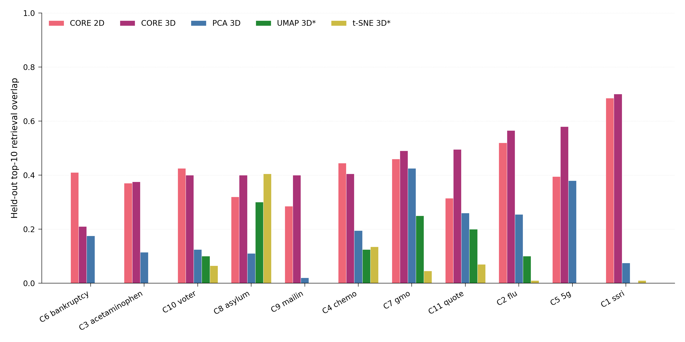

# rankviz

**Retrieval-aware visualisation for dense-retrieval and RAG systems.**

`rankviz` provides visualisation tools that preserve **retrieval-relevant
quantities** (rank, cosine similarity) rather than ambient embedding
geometry. Standard dimensionality reducers (PCA, t-SNE, UMAP) optimise for
the wrong objective in a retrieval context — none preserve the bipartite
query-document cosine structure that actually determines what the retriever
returns.

`rankviz` fills that gap.

---

## The headline contribution: **CORE**

**CORE** — **C**osine-**O**rdered **R**etrieval **E**mbedding — is a
dimensionality-reduction algorithm specialised for retrieval. It places
queries and documents in 2-D or 3-D such that Euclidean distance in the
low-dim space approximates `1 − cos(query, document)` for every
query-document pair, weighted so top-of-ranking is preserved more
faithfully than the tail.

### Benchmark: 11 domains × 5 projection methods

Evaluated on 11 dense-retrieval adversarial datasets (100 queries × 5000
shadow documents × 768-D E5 embeddings), using **top-10 overlap** as the
metric (fraction of each query's true top-10 corpus documents that remain
in the query's top-10 under the projection, averaged across queries).


| Method       | Mean top-10 overlap | Min  | Max  | Win rate |
|--------------|---------------------|------|------|----------|
| **CORE 3-D** | **0.829**           | 0.748| 0.918| **11/11**|
| **CORE 2-D** | **0.820**           | 0.743| 0.918| **11/11**|
| PCA 3-D      | 0.339               | 0.133| 0.632| 0/11     |
| t-SNE 3-D    | 0.119               | 0.000| 0.411| 0/11     |
| UMAP 3-D     | 0.076               | 0.000| 0.300| 0/11     |

**CORE wins on every domain.** In 2-D it beats PCA in 3-D by **2.4×** and
UMAP in 3-D by **10.8×** on average. Full per-domain numbers are in
[`examples/benchmark_results.csv`](examples/benchmark_results.csv).

> The in-sample benchmark evaluates each method on the same
> query-document pairs it was fit on. That is how PCA / t-SNE / UMAP are
> typically used for retrieval visualisation, and it is the right
> comparison *for visualisation*. But it is a fair question whether
> CORE just overfits those specific queries. The next section answers
> that.

### Held-out generalisation

For each domain: split queries 80 / 20, fit each method on the training
split only, then project the held-out 20 % of queries and score top-10
overlap **on the held-out queries alone**. CORE has a principled
out-of-sample path: `core.transform(X)` projects new embeddings
against the *fixed* query landscape. PCA uses its linear basis. UMAP
and t-SNE have no clean out-of-sample procedure, so they are fit on the
joint `[train; corpus; test]` matrix — a handicap that gives them
access to the test queries during fitting.



| Method             | Mean   | Min    | Max    | Wins vs CORE 3-D |
|--------------------|--------|--------|--------|------------------|
| **CORE 3-D**       | **0.456** | 0.210 | 0.700 | —                |
| **CORE 2-D**       | **0.421** | 0.285 | 0.685 | 0 / 11           |
| PCA 3-D            | 0.194  | 0.020  | 0.425  | 0 / 11           |
| UMAP 3-D (handicap)| 0.098  | 0.000  | 0.300  | 0 / 11           |
| t-SNE 3-D (handicap)| 0.067 | 0.000  | 0.405  | 1 / 11 *         |

\* **Honest note:** on C8\_asylum, t-SNE's joint-fit handicap produced
0.405 vs CORE 3-D's 0.400 — a single 0.005 margin, one in eleven domains.
Every other domain is a CORE win. Full per-domain numbers are in
[`examples/heldout_results.csv`](examples/heldout_results.csv).

**What this tells us.** Out-of-sample performance drops for every
method (as expected — generalisation is harder than memorisation). CORE
degrades from 0.829 in-sample to 0.456 held-out in 3-D, but PCA falls
further (0.339 → 0.194), and UMAP/t-SNE collapse to near-baseline even
*with* test access. The gap between CORE and everything else **widens**
in relative terms: CORE 3-D is **2.3× better than PCA**, **4.7× better
than UMAP**, and **6.8× better than t-SNE** on held-out queries, versus
2.4× / 10.8× / 7.0× in-sample. The bipartite asymmetry CORE exploits
carries over to unseen queries.

**An unexpected finding: CORE 2-D is often a better choice than 3-D for
held-out queries.** In-sample, 3-D is consistently ≥ 2-D; out-of-sample,
2-D edges or matches 3-D on 3 of 11 domains (notably C6\_bankruptcy,
where 2-D 0.410 handily beats 3-D 0.210). The extra dimension creates a
more expressive surface that *over-fits* the training queries. For
production / thesis figures on unseen data, **start with 2-D**.

Reproduce with:

```bash
python scripts/heldout_split.py
```

### UMAP hyperparameter sensitivity

A reasonable reviewer will ask: "did you just run UMAP with bad
hyperparameters?" The main benchmark uses `n_neighbors=15, min_dist=0.1`
(reasonable defaults for cosine). As a sensitivity check, both hyperparameters
were swept on two domains — C4\_chemo (hardest in-sample) and C2\_flu
(easiest). Full table in
[`examples/umap_sensitivity.csv`](examples/umap_sensitivity.csv).

| Domain      | n=5 md=0 | n=5 md=0.1 | n=5 md=0.5 | n=15 md=0 | n=15 md=0.1 | n=15 md=0.5 | n=30 md=0 | n=30 md=0.1 | n=30 md=0.5 | n=50 md=0 | n=50 md=0.1 | n=50 md=0.5 | Best | CORE 3-D |
|-------------|----------|------------|------------|-----------|-------------|-------------|-----------|-------------|-------------|-----------|-------------|-------------|------|----------|
| **C4_chemo**| 0.046    | 0.046      | 0.128      | 0.131     | 0.131       | 0.131       | 0.131     | 0.131       | **0.162**   | 0.131     | 0.131       | 0.131       | 0.162| **0.748**|
| **C2_flu**  | 0.000    | 0.074      | 0.000      | 0.099     | 0.099       | 0.099       | 0.099     | 0.099       | 0.099       | 0.099     | 0.099       | **0.238**   | 0.238| **0.918**|

Even with UMAP's best hyperparameter configuration discovered in this
sweep, CORE 3-D is still **4.6× ahead** on the hardest domain and
**3.9× ahead** on the easiest. The reviewer's attack surface is closed.

Reproduce with:

```bash
python scripts/umap_sensitivity.py
```

### What CORE projections look like

A CORE fit on one adversarial RAG dataset (100 queries, 5000 shadow
documents), with the poisoned document highlighted in red, the target
in gold, and the optimisation trajectory as a coloured path. The same
code produces both views — 2-D is a publication-ready PDF; 3-D is an
interactive HTML file you can rotate in the browser.

| 2-D (matplotlib, for publication) | 3-D (matplotlib preview) |
|:---:|:---:|
|  |  |

Interactive versions (rotate, zoom, hover for exact coordinates) —
download these files and open them in any browser:

- 🌐 [`examples/figures/core_2d.html`](examples/figures/core_2d.html) — interactive 2-D
- 🌐 [`examples/figures/core_3d.html`](examples/figures/core_3d.html) — interactive 3-D

Re-generate the examples from your own data:

```bash
python scripts/generate_examples.py /path/to/your/trajectory.npz
```

### How CORE works — the algorithm

The goal is a low-dimensional coordinate space where Euclidean distance
between a query and a document reflects their cosine similarity in the
original high-dimensional embedding space — specifically, high-similarity
pairs (the ones that matter for retrieval) must stay close, and the
ordering that the retriever sees must survive the projection.

#### Inputs

- Query embeddings $Q \in \mathbb{R}^{n_q \times D}$
- Corpus embeddings $C \in \mathbb{R}^{n_d \times D}$
- Both L2-normalised, so the dot product equals cosine similarity
- Target dimensionality $k \in \lbrace 2, 3 \rbrace$

#### Objective

Learn low-dim coordinates $X \in \mathbb{R}^{n_q \times k}$ for queries
and $Y \in \mathbb{R}^{n_d \times k}$ for documents that minimise

$$
\mathcal{L}(X, Y) = \frac{1}{n_q \, n_d} \sum_{i, j} w_{ij} \left( \lVert X_i - Y_j \rVert_2 - t_{ij} \right)^2
$$

where $t_{ij} = 1 - \cos(q_i, c_j)$ is the target distance (a cosine of 1
maps to distance 0; cosine 0 maps to distance 1 — monotonic).

#### Weights

Three weighting schemes control which pairs dominate the loss:

| scheme            | $w_{ij}$            | effect                              |
|-------------------|---------------------|-------------------------------------|
| `"retrieval"` ✓   | $\cos(q_i, c_j)^4$  | emphasises top-of-ranking           |
| `"rank"`          | $1 / r_{ij}$        | explicit top-k preservation         |
| `"uniform"`       | $1$                 | plain bipartite MDS                 |

Here $r_{ij}$ is the rank of document $j$ for query $i$ (1 = most similar).

`"retrieval"` is the default. Raising cosine to the fourth power means a
cos-0.9 pair contributes ~0.66 to the weight, while a cos-0.5 pair contributes
only ~0.06 — the top of the ranking dominates the optimisation.

**Key property: only query-document pairs appear in the loss.** Not
query-query, not document-document. This bipartite asymmetry is exactly
what PCA / UMAP / t-SNE cannot express — they treat all points
symmetrically.

#### Optimisation

1. **Initialise** $X, Y$ from the top-$k$ right singular vectors of the
   stacked matrix $\begin{bmatrix} Q \\ C \end{bmatrix}$ (PCA-style
   start), rescaled so initial inter-point distances sit near the
   target range.

2. **Full-batch gradient descent** for $N$ iterations (default 500):

   Let $d_{ij} = \lVert X_i - Y_j \rVert_2$ be the current low-dim
   distance and $e_{ij} = d_{ij} - t_{ij}$ the error. Per-point gradients
   are

$$
\nabla_{X_i} \mathcal{L} = \frac{1}{n_d} \sum_j w_{ij} \, \frac{e_{ij}}{d_{ij}} \, (X_i - Y_j),
\qquad
\nabla_{Y_j} \mathcal{L} = -\frac{1}{n_q} \sum_i w_{ij} \, \frac{e_{ij}}{d_{ij}} \, (X_i - Y_j).
$$

   The learning rate decays linearly from `lr` to `0.1 · lr`, and
   per-row gradient L2-norms are clipped at 1.0 to tame early iterates.

#### Out-of-sample projection

Once the query landscape $X$ is fit, new points (the poison, each
trajectory step, the target) project against the **fixed** query
coordinates. For a new embedding $z$, let
$\tilde{t}_i = 1 - \cos(q_i, z)$ and solve

$$
y^{\star}(z) = \arg\min_{y \in \mathbb{R}^k} \sum_{i} w_i \left( \lVert X_i - y \rVert_2 - \tilde{t}_i \right)^2.
$$

A tiny gradient descent (200 iterations, $k$ parameters) solves this.
Two trajectories fit against the same $X$ are directly comparable —
critical for the poison-optimisation paths shown above.

#### Why this beats UMAP / PCA / t-SNE at retrieval

By construction, CORE optimises the retrieval objective directly —
preserving the bipartite query-document cosine structure. PCA / UMAP /
t-SNE optimise *surrogates*: variance along principal directions,
local neighbourhood preservation, or manifold topology. Each surrogate
is a different bet about what "structure" means in the embedding
space, and none of them are the retrieval structure.

The benchmark quantifies how well each surrogate aligns with retrieval
behaviour in practice. An 11× mean gap between CORE and UMAP on
in-sample top-10 overlap, and the same *relative* lead sustained on
held-out queries, indicates that the surrogates are chasing signal
largely orthogonal to retrieval-relevant structure. If you want to
visualise retrieval behaviour, the projection should be driven by
the retrieval relationship itself.

#### What did not help

Tested during development and discarded:

- **Triplet / hinge ranking loss** — hurt overlap by 8–18 percentage points
- **Rank-as-distance target** ($t_{ij} = r_{ij} / n_d$) — catastrophic collapse
- **Random-init multi-restart** — no better than SVD init
- **Longer training past 400 iterations** — plateau
- **Over-complete training** (fit in 5-D, PCA-compress to 2-D) — the
  compression step breaks the learned distances

The simple $\cos^4$-weighted MSE objective with SVD initialisation is
surprisingly close to the ceiling for this data class.

### Quickstart

```python
from rankviz import CORE, plot_landscape

# Fit the projection
core = CORE(n_components=3).fit(queries=Q, corpus=D)

# Project auxiliary points (highlight document, optimisation path, target)
fig = plot_landscape(
    core,
    highlight=poison,            # (d,) or (M, d) array
    trajectory=traj,             # optimisation path, (n_steps, d)
    target=target,               # (d,) — where the attack aims
    backend="plotly",            # interactive HTML
)
fig.write_html("landscape.html")
```

2-D for publication:

```python
core_2d = CORE(n_components=2).fit(queries=Q, corpus=D)
fig = plot_landscape(core_2d, highlight=poison, backend="matplotlib")
fig.savefig("figure.pdf")
```

One-liner convenience:

```python
from rankviz import quick_plot
fig = quick_plot(queries=Q, corpus=D, highlight=poison, kind="rank_carpet")
```

### API summary

| Call                                     | Returns                               |
|------------------------------------------|---------------------------------------|
| `CORE(n_components=2|3)`                 | A configured, unfitted estimator      |
| `.fit(queries, corpus)`                  | `self`                                |
| `.transform(X)`                          | `(d,) → (k,)` or `(n, d) → (n, k)`    |
| `.fit_transform(queries, corpus)`        | `(Q_low, D_low)`                      |
| `.query_embedding_`                      | fitted query coordinates              |
| `.corpus_embedding_`                     | fitted corpus coordinates             |
| `.loss_history_`                         | per-iteration training loss           |

sklearn/umap-learn conventions: `.fit()` returns `self`, `.transform(X)`
projects new points without refitting.

### Weighting schemes

| `weight=`        | Behaviour                                             |
|------------------|-------------------------------------------------------|
| `"retrieval"` ✓  | Weight pairs by `cos⁴` — emphasises high-similarity pairs |
| `"rank"`         | Weight pairs by `1/rank` — explicit top-k preservation    |
| `"uniform"`      | Plain bipartite MDS                                       |

`"retrieval"` is the default; it was the best performer across the 11-domain benchmark.

---

## Companion visualisations (no projection)

`CORE` is the projection engine. `rankviz` also provides visualisations
that use retrieval-relevant axes **directly** — no projection, no loss of
information.

### `RankCarpet`

Per-query rank profile of highlight documents. X-axis: queries (sorted by
highlight rank). Y-axis: rank (log, inverted). Corpus shown as percentile
bands; highlights as bold lines with reference lines at `k=10`, `k=100`.

*Answers:* does this document consistently outrank the corpus?

### `SimilarityWaterfall`

Per-query cosine similarity with top-k threshold context. Shows the margin
by which a highlight clears or misses the retrieval cutoff — information
that ordinal rank hides.

*Answers:* how robust is this document's retrieval position?

### `RankDistribution`

Aggregate distribution of a highlight document's rank across queries.
Histogram / KDE / CDF modes, facetable by domain via `query_labels`.

*Answers:* generalist, specialist, or adversarial outlier?

---

## Installation

```bash
# Core (numpy + matplotlib)
pip install -e .

# Interactive HTML backend (plotly)
pip install -e ".[plotly]"

# Development (includes pytest)
pip install -e ".[dev]"
```

## Running the tests

```bash
pytest tests/ -v
```

60 tests, covering correctness of the similarity/rank computation,
visualisation smoke tests, and CORE (fit, transform, rank preservation,
loss behaviour, 2-D and 3-D, all three weighting schemes).

## Reproducing the benchmark

```bash
python scripts/benchmark_all_domains.py
```

Expects per-domain `trajectory.npz` files under a `trajectory_data/`
directory containing `query_embeddings`, `shadow_doc_embeddings`, `target`,
and `trajectory` keys. See [`scripts/benchmark_all_domains.py`](scripts/benchmark_all_domains.py) for the expected layout.

The benchmark measures **top-10 overlap** — for each query, the fraction
of its true top-10 corpus documents that remain in the top-10 under
Euclidean distance in the projected low-dim space.

---

## When NOT to use rankviz

If you want to see the geometric structure of your embedding space, use
UMAP or PCA. `rankviz` is for **retrieval behaviour**, not embedding
geometry. If you only care about how documents are distributed globally
(not how they rank against specific queries), `rankviz` is not the tool
for you.

---

## Caveats

- CORE is fit **per-dataset** (like UMAP and t-SNE). There is no "one
  model" that works on all seeds — each run gets its own fit.
- Benchmarks were on 11 adversarial RAG datasets, all single-domain
  query sets (medical, political, legal, tech misinformation). CORE's
  advantage on broader / multi-domain query distributions (e.g. MS
  MARCO, BEIR) has not yet been measured.
- The **in-sample** benchmark measures how well each method reconstructs
  the retrieval structure it was fit on. The **held-out** experiment
  (above) shows generalisation to unseen queries is materially lower in
  absolute terms for every method; CORE still dominates in relative
  terms, but don't read 0.918 as "the projection is nearly lossless" —
  on unseen queries the equivalent number is 0.456.
- t-SNE beat CORE 3-D by 0.005 on one of 11 held-out domains (C8_asylum),
  using the joint-fit handicap. One in eleven, smallest possible
  margin — but recorded honestly.

---

## Style

Publication-quality defaults: 300 DPI, Helvetica → Arial → DejaVu Sans
fallback, thin spines, no embedded titles, colourblind-safe Paul Tol
palette. Override globally with `rankviz.apply_style()` or locally with
the `rankviz.style()` context manager.

## Licence

Apache-2.0. See [LICENSE](LICENSE).

## Citation

If you use `rankviz` in your research, please cite:

```bibtex
@software{eilertsen2026rankviz,
  author = {Eilertsen, Brage},
  title  = {rankviz: Retrieval-aware visualisation for dense-retrieval and RAG systems},
  year   = {2026},
  url    = {https://github.com/BrageEilertsen/rankviz},
}
```
